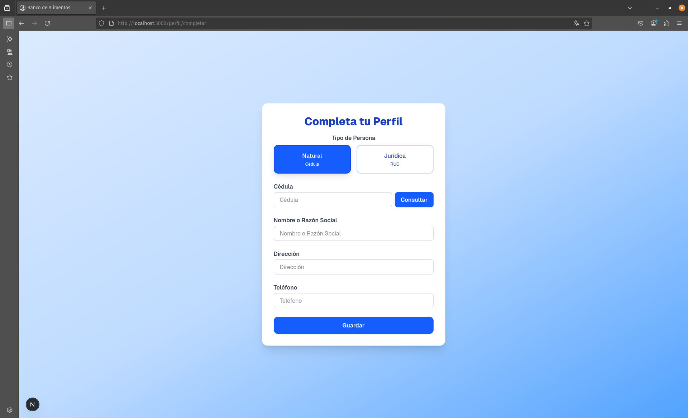

## Rutas
- /
  - Ahora incluye opciones de navegación rápida desde la landing page para mejorar el acceso de los usuarios.

- /auth/iniciar-sesion
  - El flujo de inicio de sesión requiere que el usuario complete su perfil si faltan datos esenciales.

- /auth/registrar
  - Proceso de registro simplificado: formulario mínimo, sin pasos múltiples ni validaciones extensas; onboarding mucho más rápido.


- /auth/olvide-contrasena

- /dashboard
  - Ahora muestra los detalles del perfil del usuario obtenidos directamente de la base de datos.
  - Etiquetado refinado para mayor claridad en los datos presentados.
- /perfil/completar
  - Ruta pública para completar el perfil si faltan datos obligatorios.
  - El formulario de perfil ahora solicita y valida la fecha de emisión de la cédula tanto para personas naturales como para representantes legales de personas jurídicas. Se previene el envío si la fecha no coincide con los registros oficiales, mostrando retroalimentación clara al usuario.
  


## Esquema de Base de Datos
- Valida RUC de manera más precisa.
- Valida la fecha de emisión de cédula para personas naturales y representantes legales.


## Cambios Recientes Destacados

- **Registro simplificado:** El formulario de registro es ahora mínimo, facilitando el onboarding y eliminando pasos/validaciones innecesarias.
- **Flujo de login y perfil mejorados:** Si el usuario inicia sesión pero su perfil está incompleto, el sistema lo dirige a completarlo antes de acceder a otras secciones.
- **Dashboard enriquecido:** El panel muestra los datos actuales del perfil directamente de la base de datos, con etiquetas refinadas para mayor claridad.
- **Validación de RUC optimizada:** Las comprobaciones de RUC han sido actualizadas para mayor precisión.
- **Validación de fecha de emisión de cédula:** El formulario de perfil solicita y valida la fecha de emisión de la cédula tanto para personas naturales como para representantes legales de personas jurídicas. El sistema previene el envío si la fecha no coincide con la información oficial y muestra retroalimentación clara al usuario.
- **Rutas públicas para perfil:** Los usuarios pueden completar su perfil desde rutas accesibles públicamente.
- **Mejor navegación:** Se agregaron accesos rápidos y navegación mejorada en la landing page para facilitar el flujo de usuario.

## Tecnologías Utilizadas

- **Next.js 15.3.4**
  - App Router (nueva arquitectura)
  - Server-Side Rendering (SSR)
  - Static Site Generation (SSG)
  - API Routes integradas
  - Turbopack para desarrollo rápido

- **React ^19.0.0**
  - Hooks modernos (useState, useEffect, useCallback)
  - Componentes funcionales
  - Context API para gestión de estado

- **TypeScript ^5**
  - Tipado estricto habilitado
  - Interfaces y tipos personalizados
  - Mejor experiencia de desarrollo

### **Estilos y UI**

- **Tailwind CSS ^4**
  - Diseño responsive
  - Componentes personalizables
  - Sistema de colores y espaciado consistente
  - PostCSS integrado

### **Base de Datos y Autenticación**

- **Supabase**
  - **@supabase/supabase-js ^2.50.0** - Cliente JavaScript
  - **@supabase/ssr ^0.6.1** - Soporte para Server-Side Rendering
  - Base de datos PostgreSQL
  - Autenticación integrada
  - Row Level Security (RLS)
  - APIs automáticas

### **Herramientas de Desarrollo**

- **ESLint ^9** - Linter de código JavaScript/TypeScript
  - **eslint-config-next 15.3.4** - Configuración específica para Next.js
  - **@eslint/eslintrc ^3** - Configuración moderna de ESLint

- **Node.js** - Runtime de JavaScript
  - **ts-node ^10.9.2** - Ejecución directa de TypeScript

### **Tipos y Definiciones**

- **@types/node ^20.19.1** - Tipos para Node.js
- **@types/react ^19** - Tipos para React
- **@types/react-dom ^19** - Tipos para React DOM

## Arquitectura del Proyecto

```
banco-alimentos/
├── src/
│   ├── app/                   # App Router de Next.js
│   │   ├── api/               # API Routes
│   │   ├── auth/              # Páginas de autenticación
│   │   ├── dashboard/         # Panel de control
│   │   ├── perfil/            # Páginas de perfil y completado de perfil 
│   │   ├── components/        # Componentes reutilizables
│   │   └── globals.css        # Estilos globales
│   ├── lib/                   # Utilidades y configuraciones
│   └── middleware.ts          # Middleware de Next.js
├── public/                    # Archivos estáticos
└── configuraciones/           # Archivos de configuración
```

## Comandos Disponibles

```bash
# Instalar dependencias
npm install

# Ejecutar en modo desarrollo
npm run dev

# Construir para producción
npm run build

# Ejecutar en producción
npm start

# Ejecutar linter
npm run lint
```

## Variables de Entorno

Crear un archivo `.env` con las siguientes variables:

```env
# Supabase
NEXT_PUBLIC_SUPABASE_URL=tu_url_de_supabase
NEXT_PUBLIC_SUPABASE_ANON_KEY=tu_clave_anonima_de_supabase
SUPABASE_SERVICE_ROLE_KEY=tu_clave_de_servicio_supabase
NEXT_PUBLIC_SERVICIO_CONSULTAS_RUC=tu_api_de_consultas_para_ruc
NEXT_PUBLIC_SERVICIO_CONSULTAS_DINARAP=tu_api_de_consultas_para_cedula
```